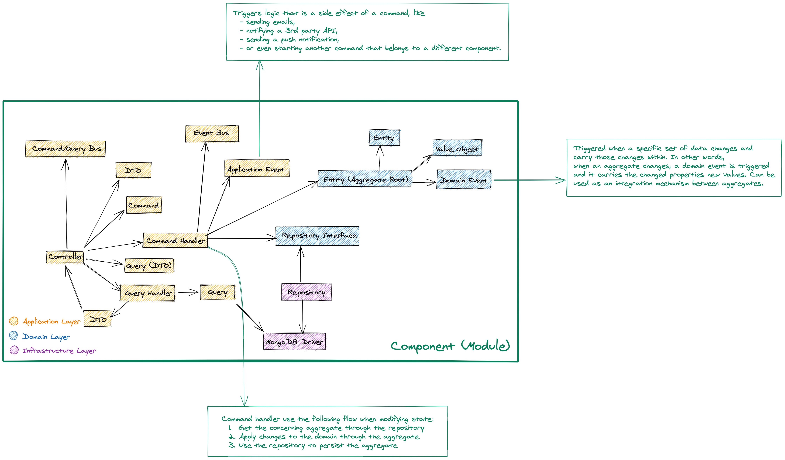

# IGassmann's Node.js API

REST HTTP API built with [NestJS](https://nestjs.com).

## Architecture

The API uses an adapted version of Herberto Graca's [Explicit Architecture](https://herbertograca.com/2017/11/16/explicit-architecture-01-ddd-hexagonal-onion-clean-cqrs-how-i-put-it-all-together/).
For simplicity's sake, it only contains one component: [`ChannelManagement`](./src/channel-management).

The domain layer is encapsulated and applies principles of functional programming inspired by
Vladimir Khorikov's [blog post series](https://enterprisecraftsmanship.com/posts/functional-c-immutability/).



## Getting Started

These instructions will get you a copy of the project up and running on your local machine for
development and testing purposes.

### Prerequisites

- [Git](https://git-scm.com/downloads)
- [Node.js](https://nodejs.org/dist/latest-v10.x/) (version specified in the engines field of [`package.json`](./package.json))
- [Yarn](https://yarnpkg.com/en/docs/install) (version specified in the engines field of [`package.json`](./package.json))

### Setup

1. Clone this repository.
2. Install dependencies by running `$ yarn`.
3. Define your `.env` file (See [`.env.example`](./.env.example)).
4. Run `$ yarn dev`.

## Developing

### Testing

Write your tests first and keep them running to catch any undesirable behavior change. The 
project use [Jest](http://jestjs.io/) as the testing framework. Run this command to keep the tests
running on change:

```bash
$ yarn test:watch
```

Tests are automatically run before pushing a branch.

### Code Linting

Code linting is handled by [ESLint](https://eslint.org/). It's configured to follow [Airbnb
JavaScript Style Guide](https://airbnb.io/javascript/). Use the following command for
linting all project's files:

```bash
$ yarn lint
```

Staged files are automatically linted before a commit.

### Code Formatting

Code formatting is handled by [Prettier](https://prettier.io/). Use the following command
for formatting all project's files:

```bash
$ yarn format
```

Staged files are automatically formatted before a commit.